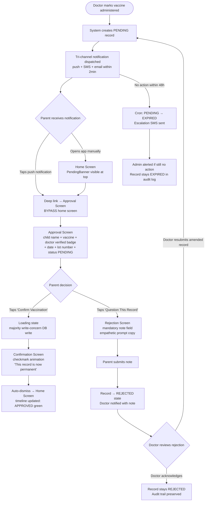
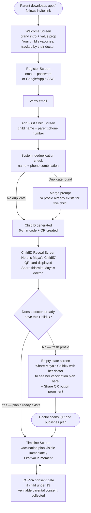
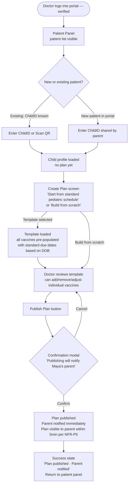
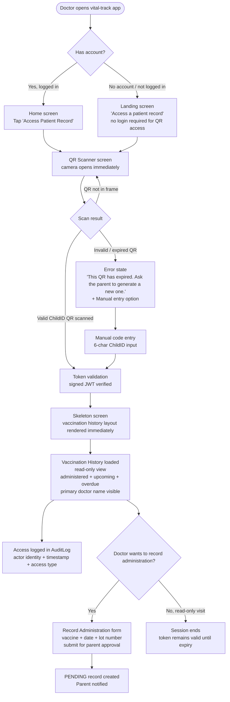
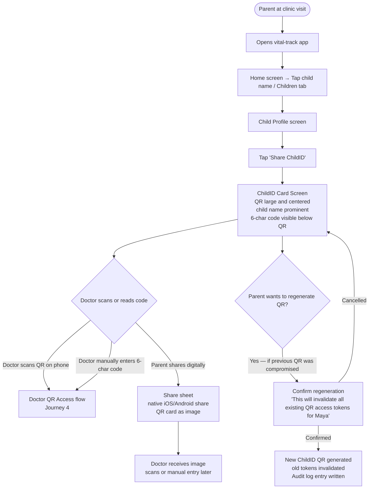
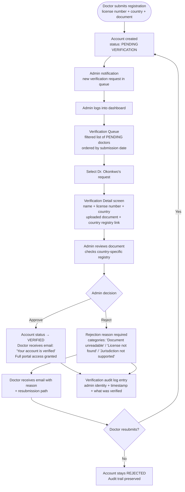

# UX Design Specification vital-track

**Author:** Prateek.magarde
**Date:** 2026-04-03

---

## Executive Summary

### Project Vision

vital-track is a cross-platform pediatric health tracking application that eliminates paper-based vaccination records by connecting parents and verified doctors around a single authoritative vaccination record per child. The doctor is the trusted data source; the parent is the final approver. Every UX decision must reinforce this trust model — making clinical data feel accessible, parental control feel empowering, and the shared record feel permanent and reliable.

### Target Users

**Parents (Primary Mobile Users)**
Busy, mobile-first caregivers who are emotionally invested in their child's health but have low tolerance for complexity. They interact primarily through push notifications, approval flows, and vaccination timeline views. They are not data entry users — they receive, review, and approve. The UX must feel effortless and trustworthy at every touchpoint.

**Doctors (Primary Web Portal Users)**
Time-pressured clinicians in active patient settings, often using tablets or desktops. They need zero-friction access to child records via QR scan, efficient plan creation from templates, and one-action administration recording. Every second of added friction erodes adoption.

**Urgent Care Doctors (Transient QR Access)**
No prior relationship with the platform. They scan a QR in a high-stress clinical moment and need immediate, read-only access to vaccination history. The experience must be instantaneous and require no account creation.

**Platform Admins (Internal Ops)**
Power users managing a credential verification queue. They need an efficient dashboard to review, approve, and reject doctor credential submissions with clear audit trails.

### Key Design Challenges

1. **Trust-building in a high-stakes medical context** — Parents are approving medical records for their children. The approval UX must feel informed and considered, never casual or rubber-stamp-like, while remaining genuinely frictionless.

2. **Three distinct surfaces, one coherent product** — Parent mobile app (notification-driven, emotional, mobile-first), Doctor web portal (task-efficient, data-dense, desktop/tablet), Admin dashboard (workflow tool). Each requires its own interaction model while maintaining brand and trust cohesion.

3. **The QR scan moment as the product's critical first impression for doctors** — The read-only vaccination history reached via QR scan must be the fastest, clearest screen in the product. No loading ambiguity, no navigation confusion.

4. **Approval fatigue vs. approval blindness** — Notification frequency and approval UX must be calibrated carefully. Too much friction causes abandonment; too little causes rubber-stamping. The 48-hour timeout and escalation chain must be invisible to parents while effective for the system.

### Design Opportunities

1. **The ChildID QR as a viral design moment** — The 6-character code + QR is a genuinely novel identity artifact. Designed beautifully and made effortless to share, it can become an organic acquisition touchpoint — parents showing it to doctors becomes a word-of-mouth event.

2. **Vaccination timeline as emotional payoff** — A parent seeing their child's complete vaccination journey — past, present, upcoming — laid out clearly for the first time is the product's core emotional moment. A well-designed timeline is potentially the most-shared screen in the app.

3. **The approval moment as a trust ritual** — Reframing parent approval from a chore into a meaningful parental act — through intentional copy, micro-interactions, and clear confirmation feedback — can differentiate vital-track's relationship with parents from every other health notification app.

## Core User Experience

### Defining Experience

vital-track's core experience is built around two parallel moments of trust:

1. **The Parent Approval Loop** — A parent receives a notification, understands exactly what happened to their child at the doctor's office, and approves with a single action. This loop must feel safe, clear, and empowering — not anxious or bureaucratic.

2. **The Doctor QR Access Moment** — A verified doctor scans or enters a ChildID and immediately sees a child's complete vaccination history. This moment must be instantaneous and require no prior relationship with the platform. It is vital-track's product promise made real in seconds.

Every other interaction in the product supports or enables these two moments.

### Platform Strategy

**Three surfaces, three interaction models:**

- **Parent Mobile App (Expo/React Native — iOS + Android):** Touch-primary, notification-driven, designed for brief, high-confidence interactions. Most interactions happen in under 60 seconds. Offline read capability for cached plans and records is a hard requirement.
- **Doctor Web Portal (Vite/React — Desktop + Tablet):** Task-efficient, data-dense, mouse+keyboard primary with tablet touch support. Designed for clinical workflows — plan creation, patient panel management, administration recording.
- **Admin Dashboard (Vite/React — Desktop):** Internal workflow tool for credential verification queue management. Power-user efficiency over visual polish.

All three surfaces share TypeScript type contracts and Zod validation schemas via the monorepo shared-types package, ensuring consistent data representation across platforms.

### Effortless Interactions

The following interactions must require zero cognitive effort:

1. **Approving a vaccine record** — One notification tap delivers the parent directly to the record. One action approves it. The UI provides enough context (doctor name, vaccine name, date, lot number) that the parent feels informed without being overwhelmed.
2. **Accessing a child's vaccination history via QR** — Scan → history. No account creation required for urgent care context. No intermediate navigation screens.
3. **Understanding what's next for a child** — The parent home screen answers "what's coming up?" immediately on open. No navigation required.
4. **Doctor marking a vaccine as administered** — From patient record → single form → submit. The parent notification is triggered automatically; the doctor does not manage that flow.

### Critical Success Moments

1. **The First Plan View (Parent)** — The moment a parent opens their child's vaccination plan for the first time and sees every administered, upcoming, and overdue vaccine clearly laid out. This is the product's primary emotional payoff — the relief of knowing. If this screen is confusing or overwhelming, the product fails.
2. **The First QR Scan (Doctor)** — The first time a doctor scans a ChildID QR and a complete vaccination history appears in under 30 seconds. If this fails, the doctor will not recommend vital-track to patients.
3. **The Approval Notification (Parent)** — The moment a parent receives an approval request and understands immediately what it means and what to do. If parents feel anxious, confused, or ignore this notification, the trust model breaks down.
4. **Credential Approval (Doctor)** — The moment a newly registered doctor's credentials are approved and they gain access to the full portal. The transition from "pending" to "verified" must feel like being granted entry, not just a status change.

### Experience Principles

1. **Trust is structural, not cosmetic** — Every screen that involves medical data must convey that records are permanent, doctor-sourced, and parent-approved. Design choices (typography, iconography, confirmation states) reinforce the integrity of the data, not just the brand.
2. **The next action is always obvious** — At every touchpoint, the user knows exactly what to do next. No dead ends. No ambiguous states. Pending records look pending. Approved records look final. Expired records explain why.
3. **Notifications do the work, the app confirms it** — Parents should not need to open the app to stay on top of their child's health. The app is where they go when a notification brings them there. Design every screen assuming the user arrived from a notification.
4. **Clinical efficiency over consumer polish (doctor surfaces)** — The doctor portal optimizes for speed and accuracy. Animations, onboarding tooltips, and decorative elements are secondary to rapid task completion. Doctors measure the product by how fast it gets out of their way.
5. **Delight lives in the details** — The ChildID QR card, the vaccination timeline, the approval confirmation animation — these are moments where vital-track can feel genuinely special. Small, intentional moments of craft create emotional memory.

## Desired Emotional Response

### Primary Emotional Goals

**For Parents:**
The primary emotional goal is **relief** — the deep, settling feeling of knowing exactly where their child stands on vaccinations without having to ask, search, or remember. Supporting this is a sense of **quiet authority**: parents are not passive recipients of medical records, they are the final gatekeepers. Every interaction should reinforce that they are in control and informed, never anxious or confused.

**For Doctors:**
The primary emotional goal is **impressed efficiency** — the immediate recognition that this tool respects their time. The secondary goal is **confidence**: records are verified, sourced from real clinical events, and actionable.

**For Urgent Care Doctors:**
**Instant relief** — they needed information fast, they got it. No friction, no surprise.

### Emotional Journey Mapping

| Stage | Parent Emotional Arc | Doctor Emotional Arc |
|-------|---------------------|---------------------|
| Discovery / Onboarding | Curious → Reassured (it's simple, it's safe) | Skeptical → Converted (it actually works) |
| First core interaction | Wonder + Relief (the timeline is complete) | Impressed (QR scan worked instantly) |
| Recurring use | Calm familiarity (I know where to go) | Habitual trust (I always check here first) |
| Error / edge case | Safe, not abandoned (clear guidance) | Informed, not blocked (actionable error states) |
| Rejection flow | Protected, not guilty (asking questions is okay) | Neutral professionalism (part of the process) |

### Micro-Emotions

**Critical positive micro-emotions to design for:**

- **Trust** at every data display (verified badge, doctor name, timestamp)
- **Calm** in the notification copy (never alarming, always clear)
- **Accomplishment** on approval confirmation (the record is now permanent)
- **Delight** in the ChildID QR share moment (this is genuinely cool)
- **Welcome** when a doctor's credentials are approved

**Micro-emotions to actively prevent:**

- **Anxiety** — Avoid ambiguous status labels, medical jargon, or unclear consequences
- **Confusion** — Every record state (PENDING, APPROVED, REJECTED, EXPIRED) must be visually distinct and plain-language explained
- **Guilt** — The rejection flow must feel safe, not accusatory; parents should feel empowered to question, not penalized
- **Overwhelm** — Onboarding must defer non-essential setup; first value moment comes before friction

### Design Implications

| Emotional Goal | UX Design Approach |
|---------------|-------------------|
| Relief (parent) | Home screen shows upcoming vaccines at-a-glance; no navigation required to answer "what's next?" |
| Quiet authority (parent) | Approval screen shows full record context before the action button; confirmation state is clear and final-feeling |
| Calm, not alarmed (notifications) | Notification copy uses plain language, never medical urgency framing; subject lines contain no PHI |
| Impressed efficiency (doctor) | QR scan → history in a single transition; no interstitial screens; loading state is a skeleton, not a spinner |
| Trust (both) | Verified badges on doctor names; immutable records display a visual lock or permanence indicator; audit timestamps visible |
| Protected during rejection | Rejection tap leads to a note field with empathetic prompt copy; confirmation message normalizes the action |
| Welcomed (new doctor) | Credential approval email and portal first-login are celebratory, not bureaucratic |
| Delight (ChildID) | QR card is beautifully designed, shareable as an image, with the child's name prominent and the code readable |

### Emotional Design Principles

1. **Calm is a design choice** — Typography, color, spacing, and copy must collectively reduce anxiety, not just avoid causing it. Health products carry emotional weight; every visual decision either adds to that weight or lightens it.
2. **Authority feels permanent** — Approved records look final. Confirmed actions feel settled. The visual language of "done" must be distinct from "pending" and unambiguous.
3. **Rejection is care, not failure** — The rejection flow must feel like a parent exercising responsible oversight, not disputing a doctor. Copy and visual framing support a collaborative tone, not adversarial.
4. **Delight is earned, not assumed** — Micro-interactions and animations appear in moments where users have already succeeded at something (approved a record, shared a QR, onboarded successfully). Never add delight before the user has accomplished their goal.
5. **The product disappears when it works** — The best notification vital-track sends is one the parent acts on in 10 seconds and forgets about. The best doctor QR scan is the one they never have to think about again. Success is invisible.

## UX Pattern Analysis & Inspiration

### Inspiring Products Analysis

**Monzo (Banking App) — Parent Notification Loop Reference**
Monzo perfected the transaction notification → instant detail pattern: push arrives, user taps, they see exactly what happened (merchant, amount, time), they can act or dismiss in under 10 seconds. No navigation. No confusion. The notification IS the UI entry point.
*Relevance to vital-track:* The parent approval flow should follow this exact mental model. Notification → record detail → one action. Parents already know this pattern.

**Apple Health — Health Data Visualization Reference**
Apple Health's timeline and category-based health data display creates a sense of calm completeness. Data is organized by category (immunizations, vitals, etc.), uses clean typography, and color-codes status without overwhelming. The empty state on a new category ("No data yet") is honest and non-alarming.
*Relevance to vital-track:* The vaccination timeline and plan view should feel like Apple Health's immunization section — familiar, clinical but calm, and clearly organized by status.

**Doximity — Doctor Professional Trust Reference**
Doximity is built around professional identity and verification. The "verified physician" badge is a core trust primitive. The interface is clean, data-dense, and respects that doctors are professionals — no onboarding tooltips, no hand-holding, no consumer-app friendliness. Fast search, fast access.
*Relevance to vital-track:* The doctor portal's professional tone, verified credential badge design, and patient panel list patterns should draw from Doximity's clinical efficiency model.

**Duolingo — Proactive Notification → Single Action Loop**
Duolingo's notification-to-habit loop is best-in-class: a push arrives at the right time, the copy creates mild urgency without alarm, and the app opens directly to the one action needed.
*Relevance to vital-track:* Proactive reminder notifications (14d/7d/day-of) must follow Duolingo's copy discipline: specific, actionable, brief. The app should open directly to the relevant child's upcoming vaccine, not the home screen.

**WhatsApp — QR Sharing UX Reference**
WhatsApp Web's QR code pairing flow is the gold standard for "show someone a QR on your phone" UX. The QR is large, prominent, centered, with clear instructions and no surrounding clutter.
*Relevance to vital-track:* The ChildID QR card share screen should take obvious inspiration from this. The QR needs to fill space confidently, with the child's name and ChildID code readable at arm's length.

### Transferable UX Patterns

**Navigation Patterns:**
- **Bottom tab navigation (mobile)** — 3-4 tabs max for parent app: Home (upcoming), Children (profiles), Notifications, Profile. Mirrors patterns from health and banking apps parents already use.
- **Role-based single SPA routing (web)** — Doctor portal and admin dashboard as separate route trees within one Vite app, switching on JWT role claim. No confusing portal selection screen; role determines experience automatically.

**Interaction Patterns:**
- **Notification-first deep linking** — Every notification deep-links to the exact record or child profile. The app never drops users at the home screen from a notification.
- **Skeleton loading over spinners** — For record lists and vaccination timelines, skeleton screens maintain layout stability during load. Borrowed from banking apps where content flash is jarring.
- **Single-action approval cards** — The pending record approval UI is a card with full context (doctor, vaccine, date, lot number) and a single prominent CTA. Modeled on Monzo's dispute resolution card pattern.
- **Status pill labels** — PENDING, APPROVED, REJECTED, EXPIRED rendered as distinct colored pill badges, never plain text. Borrowed from project management tools (Linear, GitHub PRs) where status scanning is critical.

**Visual Patterns:**
- **Verified badge** — A small, consistent visual indicator on every doctor name that confirms credential verification. Draws trust from Doximity's verified physician marker.
- **Timeline with status icons** — Vaccination plan displayed as a vertical timeline with iconographic status indicators (checkmark = administered/approved, clock = upcoming, alert = overdue, lock = approved/immutable).
- **Card-based information architecture** — Each child profile, each vaccination record, each pending approval is a card. Cards are the atomic unit of the parent app.

### Anti-Patterns to Avoid

- **Bottom sheet overuse** — Stacking multiple bottom sheets for approval flows creates disorientation on mobile. Use full-screen routes for approval actions instead.
- **Generic spinner during QR scan result load** — The doctor QR scan moment is too critical for a generic loading state. Use a skeleton of the vaccination history layout to signal the data is about to arrive.
- **Medical jargon in parent-facing copy** — Vaccine names should appear with plain-language descriptions where space allows. "DTaP (diphtheria, tetanus, pertussis)" not just "DTaP."
- **Onboarding friction before value** — Never gate the vaccination plan view behind profile completion steps. Show the plan immediately; collect optional profile data progressively.
- **Error states that don't tell users what to do** — Every error in the approval flow, QR scan flow, and notification click must include a recovery action, not just an error message.
- **PHI in push notification previews** — Notification content must follow the PRD constraint: no PHI in SMS/email subject lines or push notification previews visible on lock screens.

### Design Inspiration Strategy

**What to Adopt directly:**
- Monzo's notification → single-action card pattern for the parent approval loop
- WhatsApp's QR prominence pattern for the ChildID share screen
- Doximity's verified badge and clinical data density for the doctor portal
- Status pill labels from Linear/GitHub for record state visualization

**What to Adapt:**
- Apple Health's immunization timeline — adapt for vital-track's multi-status, doctor-sourced record model with explicit approval states
- Duolingo's proactive notification copy discipline — adapt for health context (less urgency pressure, more calm informativeness)

**What to Avoid:**
- Consumer health app "gamification" patterns (streaks, achievements, progress bars) — wrong emotional register for medical records
- EHR-style dense table layouts for parent-facing screens — doctors tolerate this; parents will not
- Modal dialogs for approval actions on mobile — full-screen routes preserve context and feel more deliberate

## Design Direction Decision

### Design Directions Explored

Six directions were generated and evaluated across three key surfaces (parent mobile app, doctor web portal, urgent care QR access):

| Direction | Character | Key Differentiator |
|-----------|-----------|-------------------|
| 1 — Calm Cards | White card-per-vaccine, bottom nav, banking-app familiarity | Maximum clarity and trust via familiar patterns |
| 2 — Timeline Focus | Teal hero header, vertical timeline as the visual hero | Vaccination journey completeness as the primary emotional payoff |
| 3 — Dark Trust | Deep navy + teal, premium and security-forward | Brand differentiation; strong for tech-savvy users |
| 4 — Minimal White | Ultra-clean list-based, maximum whitespace | Clarity and density for experienced, confident users |
| 5 — Doctor Portal | Sidebar navigation, patient panel, data-dense clinical layout | Purpose-built for clinical efficiency; Doximity-meets-Linear |
| 6 — Card Elevation | Gradient hero, layered card shadows, premium consumer | App store appeal; ChildID card as a beautiful shareable artifact |

### Chosen Direction

**Parent Mobile App:** Direction 2 — Timeline Focus
**Doctor Web Portal:** Direction 5 — Doctor Portal
**Admin Dashboard:** Direction 5 visual language (sidebar + data table pattern)

### Design Rationale

**Parent App — Direction 2 (Timeline Focus):**
The vaccination timeline as the product's visual hero directly serves the core emotional payoff identified in Step 4: a parent seeing their child's complete vaccination journey — past, present, and upcoming — for the first time. The teal header creates immediate brand identity. The pending banner at top ensures approval actions are never missed. The timeline metaphor maps perfectly to how parents think about their child's development milestones. The ChildID QR card (white card on gradient background) in this direction creates a beautifully shareable artifact that can become a word-of-mouth acquisition moment.

**Doctor Portal — Direction 5 (Doctor Portal Web):**
The sidebar navigation + patient panel layout mirrors the spatial mental model doctors already have from EMR systems (Epic, Doximity). The data density is appropriate for clinical workflows — doctors need to scan many patients quickly. The stats row (active patients, pending approvals, overdue vaccines) gives a clinic-level view at a glance. The patient row design surfaces status without requiring drill-down. The record administration form is minimal and directly maps to the clinical workflow: select vaccine → enter date + lot number → submit.

**Combined system coherence:**
Both directions share the same design token foundation (teal primary, Plus Jakarta Sans, 4px grid, status pills). The parent app's warm consumer tone and the doctor portal's clinical efficiency are intentionally distinct — they serve fundamentally different users in different contexts — but the shared token system ensures they feel like one product when a doctor uses both surfaces.

### Implementation Approach

**Parent App (apps/mobile):**
- Teal gradient header component using NativeWind linear-gradient
- `TimelineView` as the primary screen component: vertical timeline with status dots, grouped by upcoming/administered/overdue
- `PendingBanner` — sticky banner at top of timeline when approvals exist; deep-links to pending record
- `ChildIDCard` — full-screen modal with QR centered, child name prominent, share button; gradient background using brand-primary to brand-secondary
- Bottom tab navigation: Record | Children | Alerts | Profile

**Doctor Portal (apps/web):**
- Left sidebar (240px, dark navy) with brand logo, nav items, and verified doctor identity at bottom
- Main content: topbar with page title + search + scan QR action
- `PatientPanel` — list of patient rows with embedded status badges and next-due dates
- `StatsRow` — 3 metric cards (active patients, pending approvals, overdue) at top of patient list
- `RecordForm` — administration recording: vaccine selector, date, lot number (required), notes (optional), consent notice, submit CTA
- Role-based routing: doctor routes vs admin dashboard routes rendered from JWT role claim

## Design System Foundation

### Design System Choice

**Web Portal (Doctor + Admin):** shadcn/ui + Tailwind CSS v4
**Mobile App (Parent):** NativeWind v5 + custom component library
**Shared foundation:** Tailwind design tokens (colors, spacing, typography, border radius) defined in a shared config, consumed by both web and mobile surfaces

### Rationale for Selection

- **Architecture alignment:** The monorepo stack (NativeWind v5 mobile, Tailwind CSS v4 web) was defined in the Architecture document. The design system choice must work within — not against — this constraint.
- **Solo developer velocity:** shadcn/ui's copy-paste model means components are owned, not depended upon. No breaking upgrades, no library lock-in. Components live in the codebase.
- **WCAG AA compliance:** shadcn/ui uses Radix UI primitives under the hood, providing best-in-class keyboard navigation, ARIA roles, and focus management — directly satisfying PRD NFR-A1 without manual implementation.
- **Trust aesthetic alignment:** shadcn/ui's clean, minimal default aesthetic maps naturally to vital-track's clinical trust brand direction. It starts close to where we want to be.
- **Cross-surface token coherence:** Shared Tailwind color and spacing tokens ensure the parent mobile app and doctor web portal feel like one product, even though they use different component implementations.

### Implementation Approach

**Token architecture (packages/config/tailwind-tokens.ts):**
- Color palette: semantic tokens (brand-primary, brand-secondary, status-pending, status-approved, status-rejected, status-expired, surface, surface-elevated, text-primary, text-secondary, text-muted)
- Spacing scale: 4px base grid, consistent across web and mobile
- Typography: single type scale, platform-rendered (web: font-family defined in Tailwind; mobile: system fonts via NativeWind)
- Border radius: consistent scale (sm, md, lg, full) for card and pill components

**Web (apps/web):**
- Initialize shadcn/ui with Tailwind CSS v4 config
- Install components on-demand (button, card, badge, dialog, form, toast, skeleton)
- Customise theme tokens to match vital-track brand
- All components live in apps/web/src/components/ui/

**Mobile (apps/mobile):**
- NativeWind v5 with shared token config
- Custom components built in apps/mobile/components/ui/ that mirror shadcn's naming conventions
- Key components: VaccinationCard, StatusBadge, ChildIDCard, ApprovalSheet, TimelineItem

### Customization Strategy

**Design token priorities (MVP):**
1. Status colors — the four record states (PENDING, APPROVED, REJECTED, EXPIRED) need immediately distinct, accessible color pairings
2. Trust palette — primary brand color must read as calm and medical-grade, not playful or alarming
3. Typography — a clean, readable sans-serif for both surfaces; slightly larger base size than defaults for accessibility

**Component customization priorities (MVP):**
1. StatusBadge — pill component with per-state color; used everywhere a record state appears
2. VaccinationCard — card abstraction for displaying individual vaccine records with status, doctor, and date
3. ChildIDCard — the QR display card; full-bleed, child-name prominent, QR centered, shareable
4. ApprovalActionBar — sticky bottom bar for the approval screen with Approve / Reject actions
5. TimelineItem — single vaccine event in the timeline view (status icon, vaccine name, date, doctor)

## User Journey Flows

### Journey 1: Parent Approval Loop (Core Flow)

The most critical flow in the product. Every design decision in this flow must optimise for informed confidence — the parent understands what happened and acts in under 10 seconds.



**Flow notes:**
- Entry point is always the notification or PendingBanner — never buried navigation
- Approval screen is full-screen, not a modal — preserves context and feels deliberate
- Confirmation screen auto-dismisses after 2 seconds — respects the user's time
- Rejection copy: "I have a question about this record" (not "Reject") — reduces parent guilt
- Rejection note field has placeholder: "e.g. I don't recognise this doctor / visit" — guides without judging

---

### Journey 2: Parent Onboarding

A parent's first 10 minutes with vital-track must end with them seeing their child's vaccination plan. Every friction point before that moment is a risk.



**Flow notes:**
- COPPA consent is collected after the first value moment, not before — reduces abandonment
- The ChildID reveal screen is a designed moment — parents should feel like they're receiving something important
- Empty state is not a dead end — it actively prompts the parent to share the QR and explains why

---

### Journey 3: Doctor Plan Creation & Publishing

Dr. Chen's first patient on vital-track. She needs to go from blank to published plan in under 5 minutes. The standard schedule template is the key affordance.



**Flow notes:**
- Standard pediatric schedule template is the primary CTA — most doctors will use it
- DOB-based due date calculation happens automatically — doctor doesn't enter dates manually
- Publish confirmation includes "Parent will be notified" — sets doctor expectation about the consent loop

---

### Journey 4: Doctor QR Access (Urgent Care / Cross-Clinic)

Dr. Patel, 9pm, sick child, no prior relationship with vital-track. The flow must work without any existing account context.



**Flow notes:**
- No login required for QR-initiated access — the signed token IS the authentication
- Skeleton screen renders the layout before data arrives — never a blank screen or generic spinner
- Access is logged immediately on token validation — audit trail cannot be bypassed
- Manual code entry is the fallback when QR scan fails — always available

---

### Journey 5: ChildID QR Share (Parent → Doctor)

The moment that activates the network flywheel. A parent at a clinic visit shows the QR to their doctor.



**Flow notes:**
- ChildID card is full-screen — QR needs to be large enough to scan from arm's length
- QR regeneration is a destructive action — confirmation copy explains consequence
- Share sheet uses native OS sharing — QR card exported as a clean image with no app chrome

---

### Journey 6: Admin Credential Verification

Dr. Okonkwo signs up from Lagos. The admin reviews his credential submission and approves.



**Flow notes:**
- Rejection reasons are categorised (not free text) — ensures consistency and gives doctors clear guidance
- Country registry link is surfaced inline — admin doesn't need to search for the right registry
- Verification audit trail is permanent and not subject to deletion requests (per PRD domain requirements)

---

### Journey Patterns

**Navigation Patterns:**
- **Notification deep-link first** — all time-sensitive flows (approval, plan published, credential approved) enter via deep link directly to the relevant screen, never home
- **Single back action** — all flows have one unambiguous way back; no nested modal stacks
- **Confirmation before destructive actions** — QR regeneration, rejection submission, plan deletion all require a confirmation step with consequence explanation

**Decision Patterns:**
- **Binary primary actions** — all approval/decision screens present exactly two choices: primary action (Confirm/Approve) and secondary action (Question/Reject). Never three options at once.
- **Required notes on rejection** — any rejection flow requires a note before submission. Placeholder copy guides the user without judging.
- **Categorised rejection reasons (admin/doctor)** — free text is never used for rejection reasons in admin flows; categories ensure consistency and actionability

**Feedback Patterns:**
- **Skeleton screens on all async loads** — never a blank screen or generic spinner; skeleton always reflects the layout of the data that's loading
- **Full-screen confirmation states** — approval confirmation, publish success, and credential approval all use full-screen states (not toasts) because these are significant moments that deserve ceremony
- **Toast for low-stakes confirmations** — notification preference saved, profile updated, etc. use toasts that don't interrupt the flow

### Flow Optimisation Principles

1. **Entry point = relevant screen** — deep links from notifications never land on home. The user is already at the action they need to take.
2. **Zero navigation to first value** — parent onboarding ends with the vaccination plan visible; doctor QR access ends with history visible. No intermediate screens after the goal is achieved.
3. **Errors explain recovery** — every error state (expired QR, failed notification, rejected credential) includes a specific recovery action, not just a message.
4. **Destructive actions always confirm** — QR regeneration, rejections with permanent state changes, and account deactivation all pause for a confirmation with explicit consequence language.
5. **Audit trail is invisible to users, always present in system** — every state transition writes to the audit log without surfacing UI friction to the user performing the action.

## Component Strategy

### Design System Components

**Web (shadcn/ui — install on demand):**

| Component | Used in |
|-----------|---------|
| `Button` | All CTAs — Approve, Reject, Publish, Submit |
| `Badge` | Status pills (PENDING/APPROVED/REJECTED/EXPIRED) base |
| `Card` | Patient rows, record cards, stat cards |
| `Dialog` | Confirmation modals (publish plan, QR regeneration) |
| `Form` + `Input` + `Label` | Record administration form, registration, login |
| `Select` | Vaccine selector in record form |
| `Textarea` | Rejection note field, optional administration notes |
| `Skeleton` | All async loading states |
| `Toast` | Low-stakes confirmations (settings saved, profile updated) |
| `Table` | Admin verification queue, patient list (compact view) |
| `Avatar` | Doctor identity in sidebar, patient initials |
| `Sheet` | Mobile-width sidebar drawer (responsive) |
| `Separator` | Section dividers in record detail |

**Mobile (NativeWind base — no library needed):**
All layout, spacing, and typography via NativeWind utility classes. Custom components built on top of RN primitives.

---

### Custom Components

#### Mobile App (apps/mobile/components/ui/)

---

**VaccinationTimelineView**
- **Purpose:** The primary parent home screen component. Renders a child's complete vaccination plan as a scrollable vertical timeline.
- **Anatomy:** `PendingBanner` (conditional, sticky) → section headers (Overdue / Upcoming / Administered) → list of `TimelineItem` components
- **States:** Loading (skeleton), empty (no plan yet — shows share QR prompt), populated (normal timeline), with-pending (PendingBanner visible at top)
- **Variants:** Full-page (home screen), compact (child switcher preview)
- **Accessibility:** FlatList with `accessibilityLabel` per section; TimelineItem elements are individually focusable
- **Props:** `childId`, `onPendingTap`, `onVaccineTap`

---

**TimelineItem**
- **Purpose:** Single vaccine event in the timeline. The atomic unit of the vaccination record display.
- **Anatomy:** Status dot (colored circle on timeline spine) → vaccine name → plain-language description (collapsed by default) → date → doctor name + verified badge → StatusBadge
- **States:** upcoming (teal dot, future date), administered-pending (amber dot, StatusBadge PENDING), administered-approved (green dot, StatusBadge APPROVED, lock icon), overdue (red dot, overdue label), expired (grey dot)
- **Variants:** Default, expanded (shows lot number, clinic, audit timestamp)
- **Accessibility:** `role="listitem"`, vaccine name as primary label, status as secondary label
- **Interaction:** Tap expands to show full record details; tap again collapses

---

**PendingBanner**
- **Purpose:** Sticky top-of-screen alert when one or more approval actions are waiting. Critical for the approval loop entry point.
- **Anatomy:** Amber background → bell icon → "{n} vaccination{s} waiting for your approval" → "Review" chevron
- **States:** Single pending (shows vaccine name), multiple pending (shows count), none (hidden)
- **Accessibility:** `accessibilityRole="alert"`, `accessibilityLiveRegion="polite"` so screen readers announce it on appearance
- **Interaction:** Tap navigates to the first pending record's ApprovalScreen

---

**ApprovalScreen** (screen-level component)
- **Purpose:** Full-screen record review and approval/rejection interface. The defining experience component.
- **Anatomy:** Header (back + title) → ChildIdentityRow (avatar + name + ChildID + StatusBadge) → RecordDetailCard (vaccine + description + doctor + verified badge + date + lot number + clinic) → permanence notice → ApprovalActionBar
- **States:** Pending (approve + question actions active), submitting (buttons disabled, loading), confirmed (transitions to ConfirmationScreen), rejected (transitions to RejectionNoteScreen)
- **Accessibility:** RecordDetailCard fields use `accessibilityLabel` pairs (label + value); action buttons have descriptive labels beyond button text

---

**ApprovalActionBar**
- **Purpose:** Sticky bottom bar on ApprovalScreen with the two possible actions. Physically separated from record content to prevent accidental taps.
- **Anatomy:** Full-width primary button ("Confirm Vaccination") + secondary button below ("I have a question about this")
- **States:** Active, loading (primary button shows spinner, both disabled), confirmed (replaced by ConfirmationBanner)
- **Accessibility:** Primary button `accessibilityHint="Permanently adds this vaccination to [child name]'s health record"`

---

**ConfirmationScreen** (screen-level)
- **Purpose:** Full-screen post-approval state. The ceremony moment.
- **Anatomy:** Centered checkmark animation → "Vaccination Confirmed" heading → plain-language explanation → RecordSummaryCard (approved state) → "Back to [child name]'s record" button
- **Behaviour:** Auto-dismisses after 2s if no interaction; remains if user is reading

---

**ChildIDCard**
- **Purpose:** The shareable ChildID QR display. One of the product's signature visual moments.
- **Anatomy:** Full-screen with brand-primary gradient background → white card (child name + subtitle + QR code + 6-char code + expiry notice) → Share button → Powered by vital-track footer
- **States:** Valid (QR + expiry countdown), expired (QR greyed out + "Tap to refresh"), regenerated (confirmation that old tokens invalidated)
- **Variants:** Full-screen share (default), compact card (child profile preview)
- **Accessibility:** QR image has `accessibilityLabel="QR code for [child name]. Code: [6-char code]"` — screen reader users get the text code
- **Interaction:** Tap QR → enlarges to fill screen; Share button → native OS share sheet with QR as PNG image

---

**StatusBadge**
- **Purpose:** Pill badge displaying record state. Used on every vaccination record surface across both mobile and web.
- **Anatomy:** Colored dot + state label in pill shape
- **Variants:** PENDING (amber), APPROVED (green), REJECTED (red), EXPIRED (grey), UPCOMING (blue), OVERDUE (orange-red)
- **Accessibility:** Never relies on color alone — always includes text label and dot icon; `accessibilityLabel` includes full state text
- **Note:** Web version uses shadcn `Badge` as base; mobile version is NativeWind custom

---

**VerifiedBadge**
- **Purpose:** Inline trust indicator on all doctor name displays.
- **Anatomy:** brand-primary background → white checkmark → "Verified" text
- **Variants:** Full (checkmark + "Verified"), compact (checkmark only), inline (fits in a line of text)
- **Accessibility:** `accessibilityLabel="Verified physician"` on compact variant

---

#### Web Portal (apps/web/src/components/)

---

**PatientPanel**
- **Purpose:** The doctor portal's primary view — list of all patients with embedded status indicators.
- **Anatomy:** StatsRow → search + scan CTA → list of PatientRow components
- **States:** Loading (skeleton rows), empty (no patients yet — prompts to scan first ChildID), populated
- **Sorting:** Default by most recent activity; can sort by pending approvals (urgent first), overdue vaccines, or name

---

**PatientRow**
- **Purpose:** Single patient in the PatientPanel list. Must be scannable in 2 seconds.
- **Anatomy:** Avatar (initial + color) → child name + ChildID (monospace) → right: StatusBadge + next-due date + chevron
- **States:** Up-to-date (green badge), pending approval (amber badge — highest priority), overdue (red text for next-due date), action needed (left border accent)
- **Interaction:** Full row is clickable → navigates to patient detail / vaccination plan

---

**StatsRow**
- **Purpose:** At-a-glance metrics at top of PatientPanel. Clinic-level situational awareness.
- **Anatomy:** 3 metric cards: Active Patients (neutral), Pending Approvals (amber if >0), Overdue Vaccines (red if >0)
- **States:** All-clear (all neutral), attention needed (amber/red cards highlighted)

---

**RecordAdminForm**
- **Purpose:** The doctor's administration recording form. Fast and accurate — lot number is required.
- **Anatomy:** Patient identity header → vaccine selector → date input (defaults to today) → lot number input (required, monospace) → optional notes → consent notice → submit CTA
- **States:** Empty, filling, lot-number-required error, submitting (CTA disabled + spinner), success (form clears + success toast)
- **Validation:** Lot number format validated client-side via Zod schema from shared-types

---

### Component Implementation Strategy

**Build order — tied directly to user journey criticality:**

**Phase 1 — Core approval loop:**
1. `StatusBadge` + `VerifiedBadge` — used everywhere; build first
2. `ApprovalScreen` + `ApprovalActionBar` — the defining experience
3. `ConfirmationScreen` — completes the approval loop
4. `PendingBanner` — connects notification to approval screen

**Phase 2 — Timeline & ChildID:**
5. `TimelineItem` — atomic unit of vaccination display
6. `VaccinationTimelineView` — assembles TimelineItems into the home screen
7. `ChildIDCard` — QR share flow

**Phase 3 — Doctor Portal:**
8. `PatientRow` + `PatientPanel` — doctor home
9. `StatsRow` — clinic overview
10. `RecordAdminForm` — administration recording

**Phase 4 — Supporting flows:**
11. `RejectionNoteScreen` — rejection flow
12. Admin `VerificationQueue` + `VerificationDetail` — admin dashboard
13. Onboarding screens (Welcome, Register, AddChild, ChildIDReveal)

### Implementation Roadmap

**Monorepo component locations:**

```
apps/mobile/components/ui/
├── StatusBadge.tsx
├── VerifiedBadge.tsx
├── PendingBanner.tsx
├── ApprovalActionBar.tsx
├── TimelineItem.tsx
├── ChildIDCard.tsx
└── VaccinationTimelineView.tsx

apps/mobile/app/
├── (tabs)/index.tsx              ← Home (VaccinationTimelineView)
├── approval/[recordId].tsx       ← ApprovalScreen
├── approval/confirmed.tsx        ← ConfirmationScreen
└── children/[childId]/qr.tsx     ← ChildIDCard full screen

apps/web/src/components/
├── PatientRow.tsx
├── PatientPanel.tsx
├── StatsRow.tsx
└── RecordAdminForm.tsx

packages/shared-types/src/
├── models/VaccinationRecord.ts   ← StatusBadge states sourced here
└── schemas/recordAdmin.ts        ← RecordAdminForm Zod schema
```

**Shared token constraint:** All components consume tokens from `packages/config/tailwind-tokens.ts` — no hardcoded hex values in any component file.

## UX Consistency Patterns

### Button Hierarchy

**Rule: Every screen has at most one primary action.**

| Tier | Style | Usage |
|------|-------|-------|
| Primary | `brand-primary` fill, white text, `rounded-md` | The one thing we want the user to do (Confirm Vaccination, Publish Plan, Submit) |
| Secondary | Transparent, `border`, `text-secondary`, `rounded-md` | Alternative action (Question This Record, Cancel, Back) |
| Destructive | `status-rejected-bg` fill, `status-rejected-text`, `rounded-md` | Irreversible actions — only in confirmation dialogs |
| Ghost | No border, no background, `brand-primary` text | Low-emphasis navigation actions (View audit log, See all records) |

**Mobile:** Minimum touch target 44×44px. Primary button is full-width on approval and onboarding screens. Secondary buttons are narrower or text-only to create visual hierarchy.

**Loading states:** Primary button shows inline spinner and is disabled during async operations. Never replace the button with a separate loading overlay.

**Copy rules:** Verb-first, specific to the action. Never "OK", "Yes", or "Submit" alone.
- ✅ "Confirm Vaccination" / "Publish Plan" / "Approve Doctor"
- ❌ "Submit" / "OK" / "Confirm"

---

### Feedback Patterns

**Full-screen confirmation states** (high-ceremony moments):
Used when: approval confirmed, plan published, credential approved, account created.
- Centred checkmark icon (status-approved-bg circle) + heading + plain-language explanation + summary card + single action button
- Auto-dismiss after 2s if user doesn't interact; stays if user is reading

**Toast notifications** (low-ceremony moments):
Used when: settings saved, preference updated, profile updated.
- shadcn `Toast`, bottom of screen, 3s auto-dismiss, no action required
- Maximum 1 toast visible at a time

**Inline form errors** (validation failures):
- Error message below the field, `status-rejected-text` colour
- Field border changes to `status-rejected-border`
- Never toast for form validation — errors must be co-located with their field

**Empty states** (no data yet):
- Centred icon + heading + explanatory subtext + primary CTA (when applicable)
- Copy always explains *why* it's empty and *what to do*

**Error states** (system/network failures):
- Always includes: what went wrong (plain language) + what to do next (specific action)
- Never: "Something went wrong. Please try again." — always name the recovery action

---

### Form Patterns

- **Label placement:** Always above the field, never placeholder-only. Floating labels prohibited.
- **Required fields:** Red asterisk (*) next to label; "* Required fields" note above first required field.
- **Lot number field:** `font-mono` (monospace) for both input and displayed value.
- **Date fields:** Native date picker on mobile; `type="date"` + calendar icon on web. Defaults to today for administration recording.
- **Validation timing:** On blur (field exit), not on keystroke. Exception: lot number format hint shown on blur.
- **Submission:** Disable submit button during async operations. Re-enable on error with inline message. Never re-enable after success — transition to confirmation state.
- **Multi-step forms (onboarding only):** Progress indicator at top; one focused purpose per step; back navigation on all steps except first.

---

### Navigation Patterns

**Mobile — Tab bar (4 items max):**
- Parent app: Home (timeline) | Children | Notifications | Profile
- Active: `brand-primary` icon + label; Inactive: `text-muted`
- Badge on Notifications when unread (count, capped at 99+)
- Tab bar hidden on full-screen flows (ApprovalScreen, ChildIDCard, onboarding)

**Mobile — Screen navigation:**
- Expo Router file-based navigation throughout
- Back button: always top-left, `brand-primary` chevron
- Deep link entry: notification → direct to relevant screen, bypassing tab bar state

**Web — Sidebar (doctor + admin portal):**
- 240px fixed, dark navy; Active: white text + `brand-primary` right border (2px)
- Collapses to icon-only at <768px; sheet/drawer at <640px
- Current page title always in topbar

**Web — Breadcrumbs:**
- Doctor portal drill-down only: "Patients / Maya / Hepatitis B Dose 2"
- Not used in admin dashboard (flat structure)

---

### Modal and Overlay Patterns

**Confirmation dialogs** (shadcn `Dialog`):
- Used for destructive/irreversible actions only (publish plan, QR regeneration, doctor deactivation)
- Title states what's about to happen; body explains consequence; actions: Cancel + specifically-named Confirm
- Never for non-destructive actions — creates fatigue

**Bottom Sheet** (mobile):
- For filter/sort, permission selectors, notification preferences
- Never for approval flows (full-screen route instead); never stacked

**Full-screen overlays** (mobile):
- ChildIDCard, QR scanner, onboarding steps
- Expo Router modal routes, not React Native Modal component

---

### Loading and Skeleton Patterns

**Skeleton screens (always preferred over spinners):**
- Mirrors exact layout of loading data — same card dimensions, same row count
- `animate-pulse` shimmer, neutral grey
- Minimum 300ms display (prevents flash); error state after 10s timeout

**Skeleton implementations:**
- VaccinationTimelineView: 4 TimelineItem skeletons
- PatientPanel: 5 PatientRow skeletons + StatsRow skeletons
- Record detail: card-shaped skeleton matching RecordDetailCard dimensions
- QR scan result: VaccinationHistory skeleton layout

**Inline spinners (button states only):**
- 16px white spinner inside button during async mutation
- Never full-screen spinner

---

### Empty State Patterns

Every empty state: Icon (48px, `text-muted`) → Heading (what's empty) → Subtext (why + what to do) → CTA (when action exists)

| Context | Heading | CTA |
|---------|---------|-----|
| No vaccination plan | "No plan yet" | "Share ChildID" |
| No patients (doctor) | "No patients yet" | "Scan ChildID" |
| No notifications | "You're all caught up" | none |
| No pending approvals | "Nothing needs your approval" | none |
| Verification queue empty | "All requests reviewed" | none |

---

### Notification Copy Patterns

**PHI constraint:** No PHI in push preview text or SMS bodies visible on lock screens. Child names and vaccine names acceptable per parent consent; clinic names and lot numbers excluded from notification text.

**Proactive reminder (14 days):**
> "Maya has a vaccine due in 2 weeks. Open vital-track to see the schedule."

**Proactive reminder (7 days):**
> "Reminder: Maya's next vaccine is due in 7 days."

**Same-day:**
> "Today is the day — Maya has a vaccine scheduled. Check the app."

**Approval request:**
> Push: "Dr. Arora has recorded a vaccination for Maya. Tap to review and confirm."
> SMS: "vital-track: A vaccination has been recorded for Maya by Dr. Arora. Review in the app: [link]"
> Email subject: "Action needed: vaccination recorded for Maya"

**Escalation (48h no response):**
> "Reminder: A vaccination record for Maya is still waiting for your approval in vital-track."

**Copy principles:** Plain language. No medical urgency framing. No exclamation marks. No "URGENT" caps. Tone: a thoughtful reminder from a trusted source.

## Responsive Design & Accessibility

### Responsive Strategy

vital-track has three distinct surfaces with different responsive needs:

**Parent Mobile App (Expo/React Native):**
Mobile-only. No web responsive adaptation needed. Designed for iOS and Android at standard mobile screen sizes (375px–430px wide). Single-column layout throughout — no responsive breakpoints. Offline read capability is a hard requirement (PRD NFR-R3): TanStack Query cache persists plan and record data for display without network.

**Doctor Web Portal + Admin Dashboard (Vite/React):**
Three-breakpoint responsive strategy:

| Breakpoint | Width | Layout |
|------------|-------|--------|
| Mobile | < 640px | Single column; sidebar collapses to bottom sheet drawer; PatientPanel becomes full-width list |
| Tablet | 640px–1023px | Sidebar collapses to icon-only (56px); main content full width |
| Desktop | ≥ 1024px | Full sidebar (240px) + main content; two-column patient detail layout |

Design approach: Mobile-first CSS (Tailwind default). Base styles target mobile; `sm:`, `md:`, `lg:` prefixes add complexity for larger screens. The doctor portal is primarily used on desktop/tablet in clinical settings — mobile is required but not the primary design target.

---

### Breakpoint Strategy

Using Tailwind CSS v4 default breakpoints:

| Token | Width | Primary use |
|-------|-------|------------|
| `sm` | 640px | Sidebar icon-only collapse; single→two-column transitions |
| `md` | 768px | Tablet-optimised layouts; form grid adjustments |
| `lg` | 1024px | Full sidebar; two-column patient panel + detail |
| `xl` | 1280px | Max content width enforcement |

**Content width constraint:** Main content area has `max-w-[1200px]` on all web pages, `mx-auto` centered.

**Critical responsive rules:**
- Sidebar: `hidden sm:flex` — replaced by `Sheet` drawer at mobile width
- PatientPanel two-column: `flex-col lg:flex-row`
- RecordAdminForm grid: `grid-cols-1 sm:grid-cols-2`
- StatsRow: `grid-cols-1 sm:grid-cols-3`

---

### Accessibility Strategy

**Target compliance level: WCAG 2.1 Level AA** (PRD NFR-A1 web, NFR-A2 mobile — legal requirement for a healthcare product).

**Colour contrast (NFR-A5):**
- Normal text (< 18px): minimum 4.5:1 contrast ratio
- Large text (≥ 18px bold / ≥ 24px): minimum 3:1 contrast ratio
- All status badge foreground/background pairs verified against WCAG AA before implementation
- `brand-primary` (#0F766E) on white: 4.54:1 — passes AA marginally; use `text-primary` on light backgrounds for body text

**Keyboard navigation (web):**
- All interactive elements Tab-reachable in logical DOM order
- Focus ring: 2px solid `brand-primary`, 2px offset — never `outline: none` without replacement
- Modal dialogs trap focus while open; return focus to trigger on close
- Skip link: "Skip to main content" as first focusable element on every page — visible on focus only
- shadcn/ui Radix primitives handle keyboard behaviour — use them, don't rebuild

**Screen reader support (web):**
- All form inputs have associated `<label>` (not placeholder-only)
- Icons conveying meaning have `aria-label` or visually-hidden text
- Dynamic content changes use `aria-live="polite"` regions (notifications, skeleton→data, confirmation states)
- StatusBadge: `aria-label="Status: Pending approval"` — state in text, not colour alone
- PendingBanner: `role="alert"` + `aria-live="polite"`

**Mobile accessibility (iOS VoiceOver + Android TalkBack) per NFR-A2:**
- All Pressable components have `accessibilityLabel` and `accessibilityHint` where needed
- `accessibilityRole` set on all interactive components
- TimelineItem: `accessibilityLabel="[vaccine name], [status], due [date]"`
- ChildIDCard QR: `accessibilityLabel="QR code for [child name]. Code: [6-char code]. Double-tap to enlarge."`
- ApprovalActionBar primary: `accessibilityHint="Permanently adds this record to [child name]'s health history"`

**Colour blindness accommodation:**
- Status states always paired with distinct icon shape (● PENDING, ✓ APPROVED, ✗ REJECTED, — EXPIRED) + text label — never colour alone

**i18n readiness (NFR-A4):**
- All UI strings in locale files from day one (`apps/mobile/i18n/en.json`, `apps/web/src/i18n/en.json`)
- No hardcoded strings in component files
- Date formatting via `Intl.DateTimeFormat` — no hardcoded format strings
- Layout uses logical CSS properties (`ps-`, `pe-`) not directional (`pl-`, `pr-`) for future RTL support

---

### Testing Strategy

**Responsive testing:**
- Manual: iPhone 14 (390px), iPhone SE (375px), Pixel 7 (412px), iPad (768px), 13" laptop (1280px), 27" desktop (1920px)
- Browser: Chrome, Firefox, Safari, Edge
- Expo Go on physical iOS and Android devices at each development milestone

**Accessibility testing (web):**
- Automated: axe-core on all key screens as part of PR review checklist
- Keyboard-only: full doctor portal and admin dashboard navigation using Tab/Shift-Tab/Enter/Space/Escape
- Screen reader: VoiceOver (macOS/iOS) on approval flow and onboarding — full walkthrough before release
- Contrast: all custom token pairings verified before tokens are finalised

**Accessibility testing (mobile):**
- iOS VoiceOver: ApprovalScreen, ChildIDCard, VaccinationTimelineView
- Android TalkBack: same screens on Android
- React Native accessibility linter (`eslint-plugin-react-native-a11y`) in CI pipeline

**Offline performance:**
- Parent app: plan and record display verified with airplane mode enabled
- Doctor portal: read-only patient records verified with network disabled
- Write queue: pending administration records queue and sync correctly on reconnect

---

### Implementation Guidelines

**Responsive (web):**
- Tailwind responsive prefixes only — never write custom media queries
- Base styles are mobile; prefixes add complexity upward
- Use `w-full`, `max-w-[...]`, `grid-cols-*`, `flex` — never `px` for layout widths
- CSS Grid for two-column layouts, not absolute positioning
- `container` + `mx-auto px-4 sm:px-6 lg:px-8` for consistent page padding

**Accessibility (web):**
- Use shadcn/ui components as-is — Radix primitives include correct ARIA
- Never suppress focus ring without replacing it
- Every icon used for meaning needs `aria-label`
- Use `<button>` for actions, `<a>` for navigation — never `<div onClick>`
- Forms: `htmlFor` on every `<label>` matching input `id`

**Accessibility (mobile):**
- `accessibilityLabel` on every `Pressable` that isn't self-describing
- `accessibilityIgnoresInvertColors={true}` on QR codes and medical images
- Test with system font size at "Larger" (iOS) and "Largest" (Android) — layouts must not break
- Use NativeWind `rem`-equivalent scaling; avoid fixed pixel font sizes

## 2. Core User Experience

### 2.1 Defining Experience

vital-track's defining experience is the **parent approval loop**:

> A parent receives a notification that their child's doctor has recorded a vaccine. They tap it. They see exactly what happened — the vaccine name, the doctor, the date, the lot number. They tap Approve. The record is permanent.

This interaction must complete in under 10 seconds for a parent who trusts the doctor. It must also give enough information for a parent who wants to verify before approving. Both users — the trusting and the scrutinising — must feel the interaction was designed for them.

The secondary defining experience is the **doctor QR access moment**:

> A doctor scans or enters a ChildID. Within 30 seconds they see a child's complete vaccination history — administered, upcoming, overdue — without creating an account or having a prior relationship with the family's clinic.

These two experiences are the product's entire value proposition made tangible. Every other screen in vital-track exists to support or enable one of these two moments.

### 2.2 User Mental Model

**Parent mental model:**
Parents arrive at the approval screen from a push notification. Their mental model is the same as any high-stakes mobile notification action (a bank transaction approval, a two-factor authentication prompt): *"Something happened, I need to confirm or deny it."* They expect:
- Immediate context (what happened, who did it, when)
- A clear binary choice (approve or don't)
- Immediate confirmation that their action was registered
- To be done in seconds, not minutes

The current "solution" parents use is a paper card or a verbal update from the clinic. Both are passive — the parent receives information but has no action. vital-track's approval model is a new mental model: **parents as active record participants**. The UX must make this feel natural, not bureaucratic.

**Doctor mental model:**
Doctors arrive at vital-track from a parent sharing a QR or code. Their mental model is a clinical lookup tool — like searching a patient in Epic or scanning a medication barcode. They expect:
- Instant result after scan/entry
- Clear, scannable data (not walls of text)
- Obvious actions from the record view (mark administered, add note)
- To move on quickly — this is one step in a busy clinical workflow

### 2.3 Success Criteria

**Parent approval flow is successful when:**
- Time from notification tap to approval confirmation is under 10 seconds for a trusting parent
- A cautious parent can read all record details and make an informed decision without leaving the screen
- The approval confirmation feels final and trustworthy — not like a form submit
- The rejection path is equally obvious and feels safe to use
- Zero parents feel uncertain about what they approved or why

**Doctor QR access is successful when:**
- Time from QR scan to vaccination history display is under 30 seconds on a standard mobile connection (per NFR-P1)
- The first screen a doctor sees after scanning answers "what has this child received and what's coming up?" without any navigation
- A doctor who has never used vital-track before can complete a QR scan and read a vaccination history without any instruction
- Doctors describe the experience as "fast" in feedback — not "good" or "nice", specifically "fast"

### 2.4 Novel UX Patterns

vital-track introduces two genuinely novel UX patterns that require intentional design to feel intuitive:

**1. Parent-as-approver (not just viewer)**
Existing health record apps (MyChart, Apple Health, Docket) are read-only for patients. vital-track inverts this — parents are active participants in record creation. This is a new mental model. The UX must bridge from the familiar (notification → view) to the novel (notification → approve) without jarring the transition.

*Design approach:* Use the familiar notification → detail card pattern (already known from banking apps), then surface the approval action as a natural extension: "You've seen what happened. Now confirm it." The action button copy matters enormously — "Approve Record" is bureaucratic; "Confirm Vaccination" is parental.

**2. Cross-clinic record access via ChildID (no login required)**
An urgent care doctor scanning a ChildID QR and immediately accessing a vaccination history — without account creation, without prior relationship — has no direct analogue in healthcare UX. The closest patterns are AirDrop (nearby sharing, no login) and QR menu scanning at restaurants (scan → instant content).

*Design approach:* The QR landing screen for urgent care must feel like a landing page, not an app. Clear, immediate, no UI chrome. The data must be the entire screen — no navigation, no branding clutter. Add a subtle "Powered by vital-track" footer for brand attribution without competing with the clinical content.

### 2.5 Experience Mechanics

**Core Flow 1: Parent Approval**

1. **Initiation:** Push notification arrives — "Dr. Arora marked Hepatitis B Dose 2 as administered for Maya. Tap to review."
   - Copy contains no PHI (vaccine name is not PHI; child name in notification is controlled by parent consent settings)
   - Notification opens app via deep link directly to the pending record — never the home screen

2. **Interaction:** Parent sees the Approval Screen — a full-screen card with:
   - Child name + photo placeholder at top
   - Vaccine name (with plain-language description)
   - Doctor name with verified badge
   - Administration date and lot number
   - Record status: PENDING APPROVAL (amber pill badge)
   - Two actions: "Confirm Vaccination" (primary, prominent) and "Question This" (secondary, less prominent than reject implies)

3. **Feedback:**
   - Tapping "Confirm Vaccination" shows a brief loading state (the majority write-concern backend operation)
   - On success: full-screen confirmation state — checkmark animation, "Confirmed. This record is now permanent on Maya's health record." — 2 seconds, then auto-dismisses to home

4. **Completion:** Parent returns to home screen. The child's vaccination timeline now shows the vaccine as APPROVED (green pill). Notification is cleared.

---

**Core Flow 2: Doctor QR Access**

1. **Initiation:** Doctor opens vital-track app → taps "Access Patient Record" → camera opens for QR scan (or manual code entry fallback)

2. **Interaction:** Doctor scans parent's phone screen or printed QR card. System validates signed token, fetches child's vaccination history.

3. **Feedback:** Skeleton screen of vaccination history layout appears immediately during load (never a blank or spinner). Data populates within the skeleton within the 30-second NFR window.

4. **Completion:** Doctor sees full vaccination timeline — administered (with dates), upcoming (with due dates), overdue (highlighted). Primary doctor name visible. "Record administration" action available at bottom. All within a single scrollable screen.

## Visual Design Foundation

### Color System

**Design philosophy:** The vital-track color palette must read as calm, clinically trustworthy, and parental — not cold hospital white, not consumer-app playful. The palette is built around a teal-to-blue primary range (associated with healthcare trust globally), with warm neutrals for surfaces and four distinct status colors for the record state machine.

**Semantic Color Tokens (Tailwind CSS + NativeWind shared config):**

| Token | Purpose | Suggested Value |
|-------|---------|----------------|
| `brand-primary` | Primary actions, links, active states | `#0F766E` (teal-700) |
| `brand-primary-light` | Hover states, backgrounds | `#CCFBF1` (teal-100) |
| `brand-secondary` | Secondary actions, accents | `#0369A1` (sky-700) |
| `surface` | Card and page backgrounds | `#FAFAFA` (neutral-50) |
| `surface-elevated` | Elevated cards, modals | `#FFFFFF` |
| `text-primary` | Body text, headings | `#171717` (neutral-900) |
| `text-secondary` | Labels, metadata | `#525252` (neutral-600) |
| `text-muted` | Placeholders, disabled | `#A3A3A3` (neutral-400) |
| `border` | Card borders, dividers | `#E5E5E5` (neutral-200) |

**Status Color Tokens (Record State Machine):**

| State | Token | Background | Text | Border | Meaning |
|-------|-------|-----------|------|--------|---------|
| PENDING | `status-pending` | `#FEF3C7` | `#92400E` | `#FCD34D` | Awaiting action — amber |
| APPROVED | `status-approved` | `#DCFCE7` | `#166534` | `#86EFAC` | Confirmed, permanent — green |
| REJECTED | `status-rejected` | `#FEE2E2` | `#991B1B` | `#FCA5A5` | Questioned, not hostile — red |
| EXPIRED | `status-expired` | `#F5F5F5` | `#525252` | `#D4D4D4` | Time passed, neutral — grey |

**Verified badge:** `#0F766E` (brand-primary) background with white checkmark — signals clinical trust, not a gamification star.

**Accessibility:** All foreground/background token pairings must achieve minimum 4.5:1 contrast ratio (WCAG AA) for normal text, 3:1 for large text. Status tokens are designed to meet this requirement; verify with a contrast checker before implementation.

### Typography System

**Font choice:** **Plus Jakarta Sans** (Google Fonts, free) — warm, modern, highly legible at small sizes, feels approachable without being playful. Works well for both clinical data (doctor portal) and parental UX (mobile app).

*Fallback stack:* `'Plus Jakarta Sans', 'Inter', system-ui, sans-serif`

**Type Scale (4px base unit, 1.25 major third scale):**

| Token | Size | Weight | Line Height | Usage |
|-------|------|--------|------------|-------|
| `text-xs` | 12px | 400 | 1.5 | Timestamps, metadata, lot numbers |
| `text-sm` | 14px | 400/500 | 1.5 | Labels, secondary body, pill badge text |
| `text-base` | 16px | 400 | 1.6 | Primary body text, form inputs |
| `text-lg` | 18px | 500 | 1.4 | Card titles, section headers |
| `text-xl` | 20px | 600 | 1.3 | Screen titles (mobile) |
| `text-2xl` | 24px | 700 | 1.2 | Page headings (web portal) |
| `text-3xl` | 30px | 700 | 1.1 | Large headings, confirmation states |

**Mobile note:** Base font size increases to 16px minimum on mobile (no 12px body text on small screens) to satisfy NFR-A2 accessibility requirements.

### Spacing & Layout Foundation

**Base unit:** 4px grid (all spacing values are multiples of 4)

**Spacing scale:**

| Token | Value | Usage |
|-------|-------|-------|
| `space-1` | 4px | Icon padding, tight gaps |
| `space-2` | 8px | Inline element gaps |
| `space-3` | 12px | Label-to-input gap |
| `space-4` | 16px | Card internal padding, standard gaps |
| `space-6` | 24px | Section separation |
| `space-8` | 32px | Major section breaks |
| `space-12` | 48px | Screen-level padding |
| `space-16` | 64px | Hero-level spacing |

**Layout principles:**
- **Parent app (mobile):** Single-column, full-bleed cards. Bottom safe area reserved for action bars (Approve/Reject). Tab bar height: 56px + safe area inset. Card padding: 16px all sides.
- **Doctor portal (web):** Sidebar navigation (240px) + main content area. Content max-width: 1200px. Two-column layout for patient panel + detail view on desktop, single column on tablet.
- **Admin dashboard (web):** Full-width table layout optimized for data density. Sidebar navigation (240px). Table row height: 48px.

**Border radius scale:**
- `rounded-sm` (4px) — Input fields, small chips
- `rounded-md` (8px) — Cards, buttons
- `rounded-lg` (12px) — Modal panels, elevated cards
- `rounded-full` — Status pill badges, avatar circles

### Accessibility Considerations

- All interactive elements must have a minimum touch target of 44×44px on mobile (iOS HIG / Android guidelines)
- Focus ring style: 2px solid `brand-primary` with 2px offset — visible on all backgrounds
- Status colors never convey meaning through color alone — always paired with an icon and text label (satisfies WCAG 1.4.1 Use of Color)
- Skeleton loading components use a neutral shimmer animation — no flashing (satisfies WCAG 2.3.1 Three Flashes)
- All form inputs include visible labels (no placeholder-only labels) for screen reader compatibility
- i18n-ready from day one: no hard-coded strings in components; all UI copy in locale files (satisfies NFR-A4)
